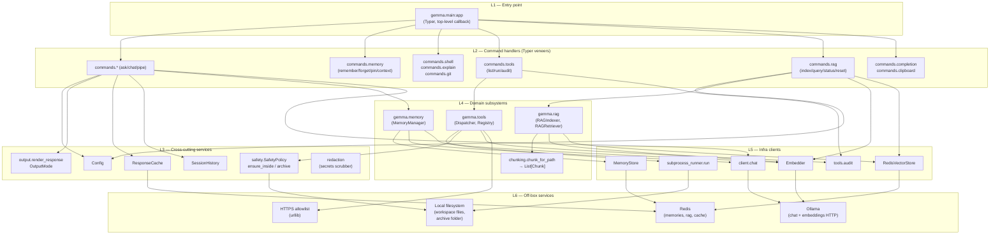
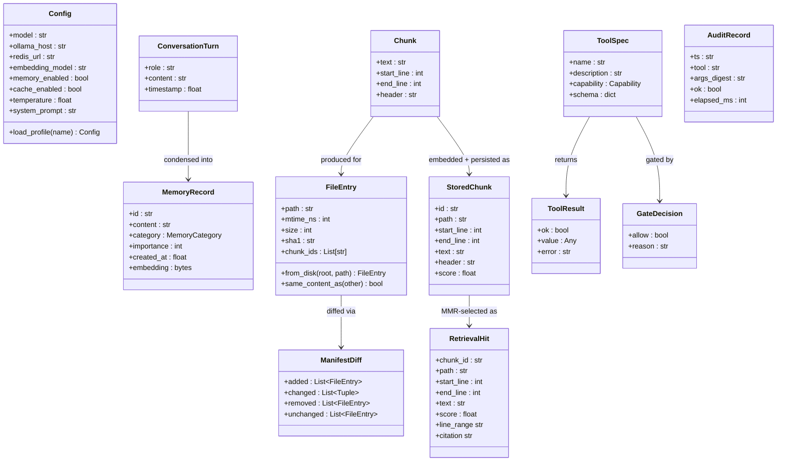
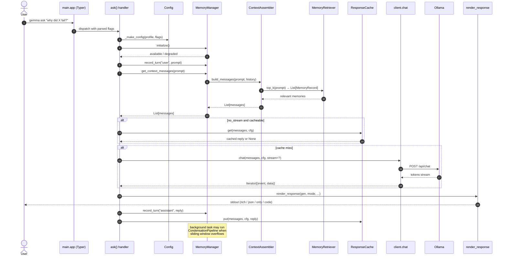
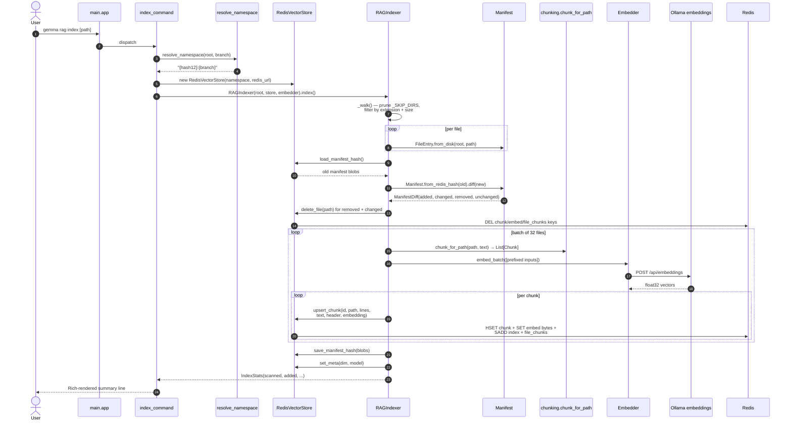
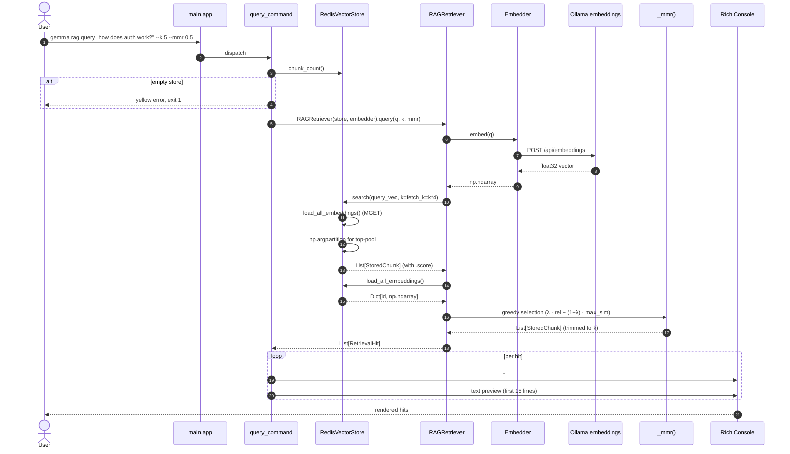
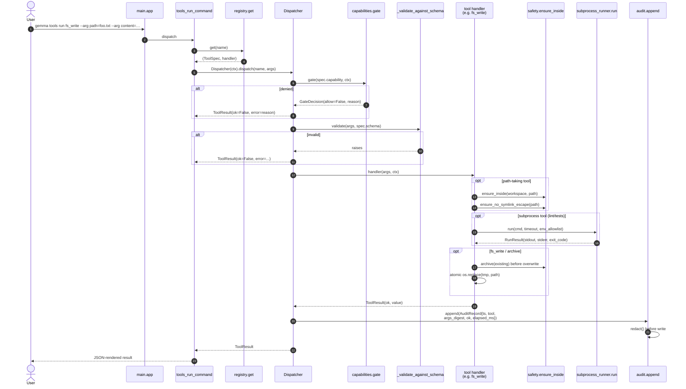
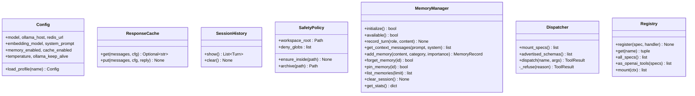
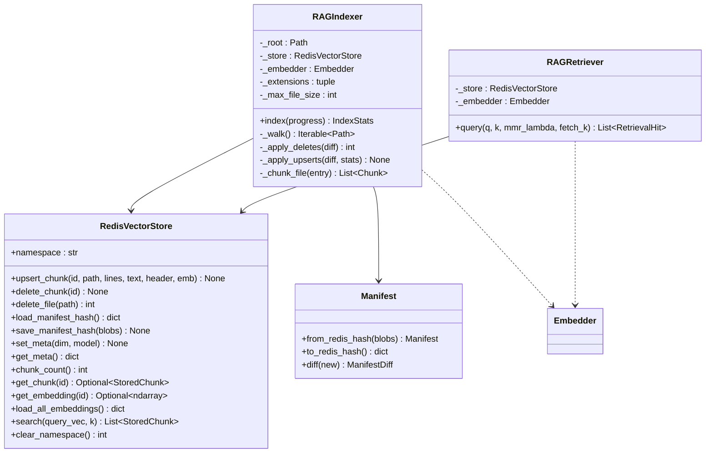
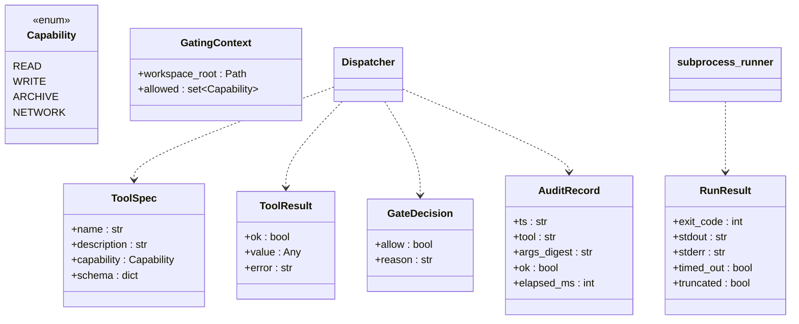

# gemma-cli — Architecture Overview

> A layered map of how a CLI invocation flows through the codebase. Every box is
> a concrete class or module; every arrow names the data object that crosses it.
> All diagrams are Mermaid — they render natively in GitHub, GitLab, VS Code
> (with the Mermaid extension), and most modern Markdown viewers.

---

## Contents

1. [Big picture — seven layers](#1-big-picture--seven-layers)
2. [Data objects that cross layers](#2-data-objects-that-cross-layers)
3. [Flow: `gemma ask "…"`](#3-flow-gemma-ask-)
4. [Flow: `gemma rag index`](#4-flow-gemma-rag-index)
5. [Flow: `gemma rag query`](#5-flow-gemma-rag-query)
6. [Flow: `gemma tools run`](#6-flow-gemma-tools-run)
7. [Class reference — methods at a glance](#7-class-reference--methods-at-a-glance)

---

## 1. Big picture — seven layers

The codebase is intentionally layered: each arrow points **down** toward
infrastructure. No lower layer imports anything from a higher layer. The
`gemma.commands.*` package is the only place that knows about Typer; the domain
packages (`memory`, `rag`, `tools`) are pure Python and therefore trivially
testable.

**How to read the layers**

| Layer | Owns                               | Key invariant                                     |
|-------|------------------------------------|---------------------------------------------------|
| L1    | Typer `app`, global `--profile`    | Decides *which* handler runs; no business logic.  |
| L2    | One module per command family      | Parses Typer args → calls L3/L4. No Ollama/Redis. |
| L3    | Config, output mode, cache, safety | Pure helpers; safe to import from anywhere in L4. |
| L4    | Memory, tools, RAG subsystems      | All domain logic lives here; hermetic under test. |
| L5    | HTTP + Redis + subprocess clients  | Only layer that performs I/O to external systems. |
| L6    | Ollama, Redis, local FS, HTTPS     | Ground truth — nothing else is authoritative.     |

---

## 2. Data objects that cross layers

These are the value objects that flow between layers. Every one is an
`@dataclass` (or `Enum`) with explicit fields — no stringly-typed dicts crossing
module boundaries.

---

## 3. Flow: `gemma ask "…"`

The most-travelled path. Memory-augmented, cache-aware, supports streaming and
three scripting output modes (`--json / --only / --code`).

**Where things can go quiet:**

- `Mgr.initialize()` returns `degraded=True` if Redis is unreachable — a warning
  prints but the command proceeds stateless.
- `Cache` only engages when `--no-stream` is set *and* temperature is below the
  cache ceiling; streaming responses skip the cache entirely.
- If `--cache-only` is set and there is no hit, the handler exits **1**.

---

## 4. Flow: `gemma rag index`

Incremental indexer. The second run after a single-file edit embeds exactly one
file's chunks — everything else is a no-op diff.

**Invariants enforced here:**

- Write-only to Redis; the indexer never mutates files on disk (honours the
  never-delete rule).
- Embeddings are L2-normalised before `upsert_chunk`, so downstream cosine is a
  plain dot product.
- `save_manifest_hash` does a pipelined DEL + HSET to replace the hash
  atomically (no orphan entries).

---

## 5. Flow: `gemma rag query`

Cosine top-`fetch_k` against the store, then MMR-shrunk to `k`. No Ollama call
happens if the query is whitespace, the store is empty, or the embedder raises.

**Graceful-degradation contract:** every early exit in `RAGRetriever.query`
returns `[]` so the CLI can always render "no hits" cleanly — never a traceback
in the user's terminal.

---

## 6. Flow: `gemma tools run`

The tool-use subsystem. Same dispatcher the chat-loop uses when a model emits a
tool call. Every hop is gated and audited.

**Security posture encoded in this flow:**

- There is no `fs_delete` handler in the registry — the never-delete rule is
  enforced by *omission*, not by a runtime check that could be bypassed.
- Capability gating runs **before** schema validation so a disallowed tool
  never sees its arguments.
- `AuditRecord` paths are hashed (`PathDigest`) so the log never leaks absolute
  filesystem layout.

---

## 7. Class reference — methods at a glance

### L3/L4 classes

### RAG classes

### Tools classes

---

## Living document

When a new subsystem lands, add a section 8+ with its own sequence diagram.
Keep every sequence diagram self-contained — a reader should not have to chase
imports across multiple files to understand one flow.

_Last synchronised against code: Phase 6.2 (RAG subsystem, `rag` Typer group)._
